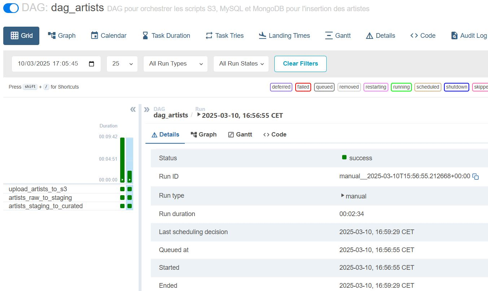
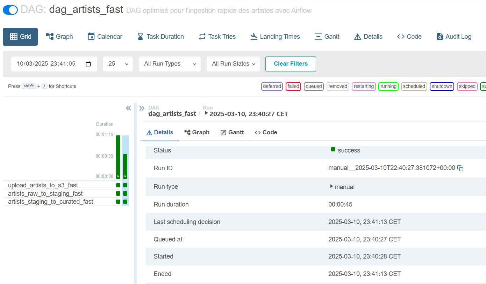
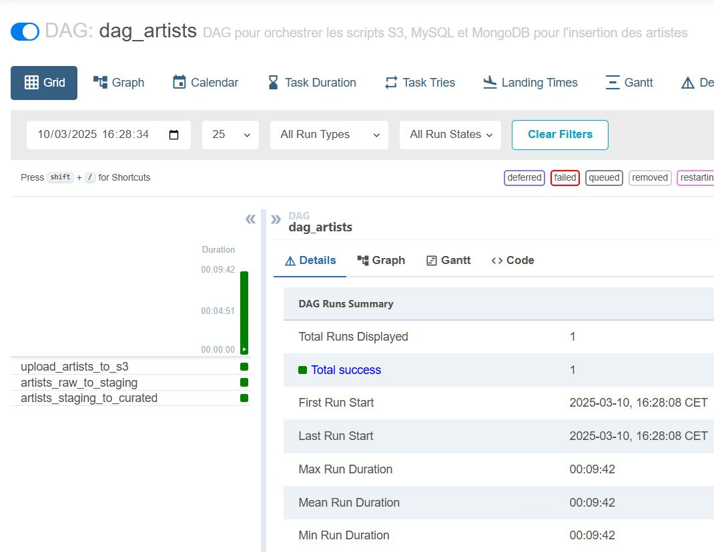
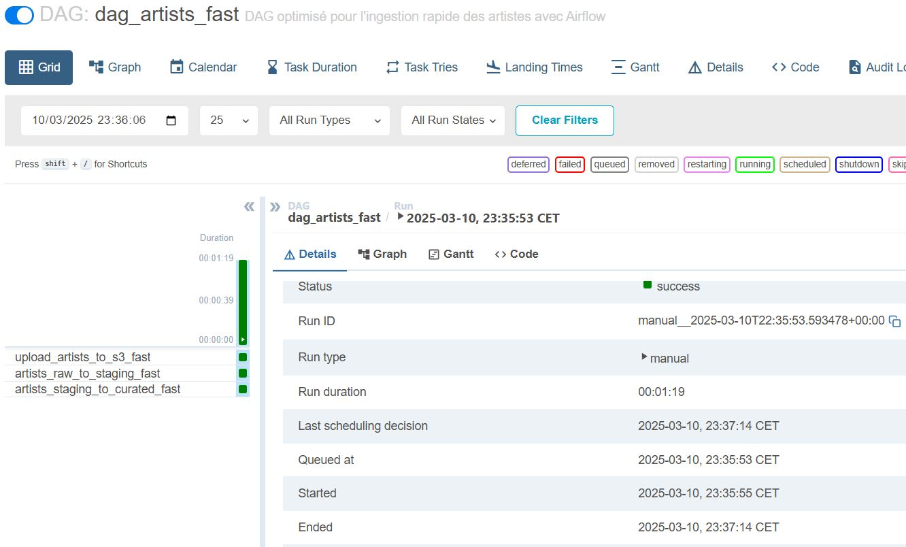
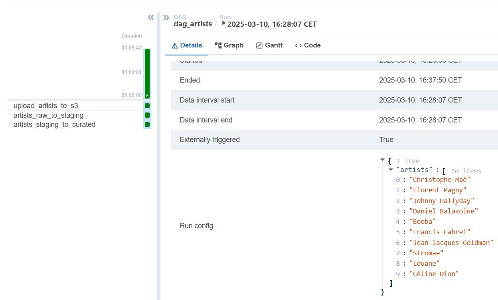
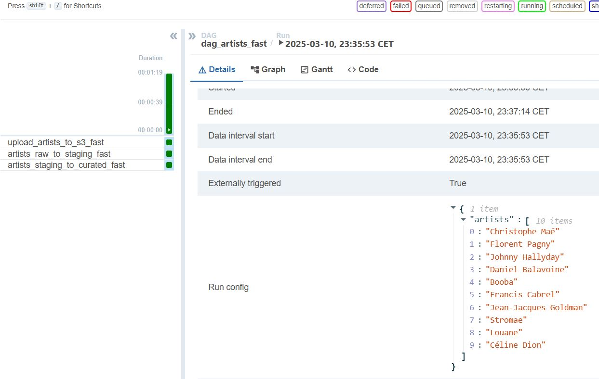

# Projet_DLK

## Description

**Projet_DLK** est une solution complète d'ingestion, de transformation et de stockage de données pour les artistes et chansons à partir de l'API Genius. L'architecture repose sur plusieurs étapes de traitement orchestrées par Apache Airflow, avec un stockage des données dans S3, MySQL et MongoDB.

---

## Architecture

Le projet utilise trois principales couches de stockage :

- **S3 (Raw Layer)** : Stockage brut des données JSON récupérées depuis l'API Genius.
- **MySQL (Staging Layer)** : Stockage intermédiaire permettant des transformations et nettoyages avant la finalisation.
- **MongoDB (Curated Layer)** : Stockage final optimisé pour la consommation de données.

---

## Flux de données

1. **Ingestion des données brutes**  
   - Les chansons et artistes spécifiés sont récupérés depuis l'API Genius et stockés sous forme de fichiers JSON dans S3.  
   - Pour chaque artiste, nous récupérons ses 20 chansons les plus populaires en sélectionnant les champs suivants :  

     Artiste :  
     - name  
     - image_url  
     - bio  

     Chanson :  
     - title  
     - url  
     - image_url  
     - language  
     - release_date  
     - pageviews  
     - lyrics  
     - french_lyrics  

   - Les paroles sont extraites via du scraping et la traduction en français est récupérée si disponible.  

2. **Transformation et stockage intermédiaire (MySQL)**  
   - Extraction des données depuis S3 et insertion dans MySQL avec nettoyage :  

     - Suppression des caractères spéciaux dans les noms d’artistes et de chansons  
     - Structuration dans deux tables : artists et songs  
     - Ajout d’une contrainte d’unicité (artist_id, title) pour éviter les doublons  
     - Filtrage des chansons sans paroles disponibles (lyrics_state != "complete")  
     - Formatage des dates (release_date) pour respecter le format MySQL (YYYY-MM-DD)  

3. **Enrichissement et migration vers MongoDB**  
   - Récupération des données depuis MySQL et transformation pour un stockage optimisé dans MongoDB :  

     - Ajout des paroles en français  
     - Génération de trois niveaux de difficulté pour masquer un pourcentage des mots dans les paroles :  

       Facile : 10% des mots masqués  
       Moyen : 25% des mots masqués  
       Difficile : 40% des mots masqués  

     - Stockage sous forme de documents JSON optimisés, associant chaque chanson à son artiste via un ID unique.  

---

## Version rapide

Une version optimisée du pipeline a été développée pour améliorer les performances d'ingestion et de transformation des données en réduisant le temps de traitement d'au moins 30 %. Cette optimisation repose sur plusieurs techniques :

1. **Optimisation de l'ingestion des données brutes**  
   - Utilisation de **ThreadPoolExecutor** pour effectuer plusieurs requêtes à l'API Genius en parallèle.  
   - Scraping des paroles et récupération des traductions en **multithreading**.  
   - Réutilisation des **sessions HTTP** pour éviter les reconnections inutiles.  
   - Téléversement sur **S3** en parallèle pour plusieurs artistes et chansons.  

2. **Accélération de la transformation MySQL**  
   - Extraction depuis **S3** et insertion dans **MySQL** avec **connexion par thread** pour éviter les blocages.  
   - Traitement **par lot** des insertions et mises à jour pour réduire le nombre d'opérations SQL.  
   - Suppression des **requêtes redondantes** et amélioration du formatage des dates et du nettoyage des paroles.  

3. **Migration rapide vers MongoDB**  
   - Chargement des artistes et chansons en **multithreading**.  
   - Utilisation de **ReplaceOne avec bulk_write** pour insérer ou mettre à jour plusieurs documents en une seule requête.  
   - Génération des niveaux de difficulté des paroles en **vectorisation** avec NumPy.  
   - Optimisation de la récupération des relations artistes-chansons en **requêtes groupées** depuis MySQL.  

Cette version permet une ingestion et une transformation plus rapides tout en conservant la structure et l'intégrité des données.

---

## Orchestration avec Airflow

L'ingestion et la transformation des données sont orchestrées à l'aide de **DAGs Airflow**, permettant d'exécuter les tâches en séquence et de gérer les dépendances.

1. **DAG pour les artistes (`dag_artists`)**  
   - Télécharge les données d'un artiste sur S3.  
   - Transforme et insère les données dans MySQL.  
   - Migre les données enrichies vers MongoDB.  

2. **DAG pour les chansons (`dag_songs`)**  
   - Récupère les détails d'une chanson et les stocke sur S3.  
   - Effectue la transformation et l'insertion dans MySQL.  
   - Finalise la migration vers MongoDB.  

3. **Version optimisée (`dag_artists_fast`, `dag_songs_fast`)**  
   - Exécute les étapes en **multithreading** pour un traitement plus rapide.  
   - Réduit le temps d'exécution avec des requêtes et insertions **par lots**.  
   - Améliore l'efficacité du stockage et des transferts.

---

## Lancement du projet

### Prérequis

- **Docker & Docker Compose** : Assurez-vous que Docker est installé.
- **Node.js & npm** : Pour lancer le frontend React.
- **Attention** : Le lancement peut échouer si les scripts `init_scheduler.sh` et `init_webserver.sh` sont en **CRLF** au lieu de **LF**. Il faut changer ça avant de lancer la commande docker.  

### Étapes

1. **Cloner le dépôt dans un dossier vierge:**
```bash
git clone https://github.com/baltasarbn6/Projet_DLK.git
```

2. **Aller à la racine du projet :**
```bash
cd Projet_DLK
```

3. **Traiter les variables d'environnement :**

Copier le fichier env (sur Moodle) `.env` à la **racine** du projet ainsi que dans le dossier **/api**, afin que l'application puisse charger correctement les variables d’environnement.

4. **Démarrer les services Docker :**
```bash
docker-compose up --build
```
Attendez que tous les services aient terminé leur démarrage avant d’accéder à l’application.

4. **Installer les dépendances du frontend :**
```bash
cd frontend
npm install
```

5. **Lancer le frontend en mode développement :**
```bash
npm run dev
```

### Accès aux services

- **Airflow UI :** `http://localhost:8080`  
  Interface de gestion des DAGs pour orchestrer les tâches d'ingestion et de transformation des données.  

- **Swagger UI :** `http://localhost:8000/docs`  
  Interface pour tester l'API et interagir avec les endpoints disponibles. Permet d'envoyer des requêtes pour ingérer des artistes et des chansons directement via l'API.  

- **Frontend :** `http://localhost:5173`  
  Interface utilisateur permettant de jouer.  


---

## Endpoints de l'API

### **Récupération des données brutes depuis S3 :**
```http
GET http://localhost:8000/raw

GET http://localhost:8000/raw/artist/{artist_name}

GET http://localhost:8000/raw/song/{artist_name}/{song_title}
```

### **Récupération des données en staging depuis MySQL :**
```http
GET http://localhost:8000/staging

GET http://localhost:8000/staging/artists

GET http://localhost:8000/staging/songs
```

### **Récupération des données en curated depuis MongoDB :**
```http
GET http://localhost:8000/curated

GET http://localhost:8000/curated/artists

GET http://localhost:8000/curated/songs
```

### **Vérification de la santé des services :**
```http
GET http://localhost:8000/health
```

### **Statistiques sur les données stockées :**
```http
GET http://localhost:8000/stats
```

### **Supression des données stockées :**
```http
GET http://localhost:8000/delete_s3

GET http://localhost:8000/delete_mysql

GET http://localhost:8000/delete_mongo

GET http://localhost:8000/delete_all
```

---

## Ingestion des données via Airflow

### **Ingestion par artistes :**
```bash
curl -X POST http://localhost:8000/ingest -H 'Content-Type: application/json' -d '{"artists": ["artist1", "artist2", ...]}'
```

### **Ingestion par chansons :**
```bash
curl -X POST http://localhost:8000/ingest_songs -H 'Content-Type: application/json' -d '{"songs": [{"title": "title1", "artist": "artist1"}, {"title": "title2", "artist": "artist2"}, ...]}'
```

### **Ingestion optimisée par artistes :**
```bash
curl -X POST http://localhost:8000/ingest_fast -H 'Content-Type: application/json' -d '{"artists": ["artist1", "artist2", ...]}'
```

### **Ingestion optimisée par chansons :**
```bash
curl -X POST http://localhost:8000/ingest_songs_fast -H 'Content-Type: application/json' -d '{"songs": [{"title": "title1", "artist": "artist1"}, {"title": "title2", "artist": "artist2"}, ...]}'
```

### **Exemple de curl pour test avec 1 élèment pour /ingest ou /ingest_fast :**
```bash
curl -X POST "http://localhost:8000/ingest" -H "Content-Type: application/json" -d '{"artists": ["Aya Nakamura"]}'

curl -X POST "http://localhost:8000/ingest_fast" -H "Content-Type: application/json" -d '{"artists": ["Aya Nakamura"]}'

curl -X POST "http://localhost:8000/ingest" -H "Content-Type: application/json" -d '{"artists": ["The Beatles"]}'

curl -X POST "http://localhost:8000/ingest_fast" -H "Content-Type: application/json" -d '{"artists": ["The Beatles"]}'
```

### **Exemple de curl pour test avec 10 élèments pour /ingest ou /ingest_fast :**
```bash
curl -X POST "http://localhost:8000/ingest" -H "Content-Type: application/json" -d '{"artists": ["Christophe Maé","Florent Pagny","Johnny Hallyday","Daniel Balavoine","Booba","Francis Cabrel","Jean-Jacques Goldman","Stromae","Louane","Céline Dion"]}'

curl -X POST "http://localhost:8000/ingest_fast" -H "Content-Type: application/json" -d '{"artists": ["Christophe Maé","Florent Pagny","Johnny Hallyday","Daniel Balavoine","Booba","Francis Cabrel","Jean-Jacques Goldman","Stromae","Louane","Céline Dion"]}'

curl -X POST "http://localhost:8000/ingest" -H "Content-Type: application/json" -d '{"artists": ["Indochine","Mylène Farmer","Patrick Bruel","Zazie","Lorie","Garou","Vianney","Drake","Taylor Swift","The Weeknd"]}'

curl -X POST "http://localhost:8000/ingest_fast" -H "Content-Type: application/json" -d '{"artists": ["Indochine","Mylène Farmer","Patrick Bruel","Zazie","Lorie","Garou","Vianney","Drake","Taylor Swift","The Weeknd"]}'
```

---

## Résultats d'ingestion et comparaison des performances

### Comparaison entre `dag_artists` et `dag_artists_fast`

#### Test sur 1 artiste
- **Version standard** : 2 minutes 34 secondes  
- **Version optimisée** : 45 secondes  

  
*DAG standard exécuté sur 1 artiste.*

  
*DAG optimisé exécuté sur le même artiste.*

#### Test sur 10 artistes
- **Version standard** : 9 minutes 42 secondes  
- **Version optimisée** : 1 minute 19 secondes  

  
*DAG standard exécuté sur 10 artistes.*

  
*DAG optimisé exécuté sur les mêmes 10 artistes.*

### Preuve du curl

#### Requête pour `dag_artists`
  
*Exécution du DAG standard via cURL pour 10 artistes.*

#### Requête pour `dag_artists_fast`
  
*Exécution du DAG optimisé via cURL pour les mêmes 10 artistes.*

### Conclusion
La version `dag_artists_fast` offre une accélération significative de l'ingestion :
- **Réduction du temps de traitement d'environ 80-85%**.
- **Meilleure gestion des ressources** grâce au parallélisme.
- **Exécution plus rapide même sur un grand volume de données**.

---

## Remarques
- Assurez-vous de bien copier le fichier `env` de Moodle et de le renommer en `.env`.
- Avant chaque nouvelle exécution, vérifiez que tous les conteneurs Docker sont bien opérationnels avec `docker ps`.
- Il faut attendre la fin de démarrage du webserver de Airflow avant de démarrer les ingestions.
- Pour voir ce qui n'a pas été trouvé dans Genius (peut-être un problème d'écriture d'un artiste ou d'une chanson), il faut remonter les logs du Scheduler.
